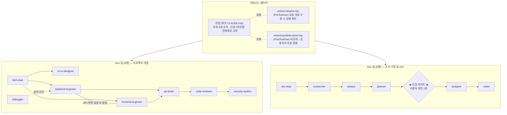

# AI Agent Workspace — 멀티 에이전트 개발 조직 거버넌스

> Claude Code 위에 **역할별 AI 에이전트 15명으로 구성된 "개발 조직"** 을 만들고,
> 헌법(거버넌스 문서) + 훅(코드 강제) + 파이프라인(워크플로우)으로 운영해 온 **실제 사용 중인 작업공간**의 공개 쇼케이스입니다.
>
> 여기 있는 에이전트 정의·훅 코드·운영 문서는 장식용 샘플이 아니라, 아래 "이 체계로 만든 것"의 프로젝트들을 실제로 개발·이관·고도화하는 데 매일 쓰이고 있는 파일들입니다. (개인정보·비공개 정보만 마스킹)

## 왜 만들었나

AI에게 일을 시키다 보면 세 가지 문제가 반복됩니다.

1. **한 컨텍스트가 모든 걸 떠안는다** — 기획·구현·테스트·리뷰가 한 대화에 섞여 품질이 떨어진다.
2. **규칙이 말로만 존재한다** — "이 파일은 건드리지 마"라고 적어도, AI가 잊거나 무시하면 그만이다.
3. **비싼 단계 앞에서 확인이 없다** — 방향이 틀린 채로 산출물을 다 만들고 나서야 잘못을 안다.

이 작업공간은 그 답으로 **① 역할 분리(직원 에이전트), ② 코드 수준 강제(훅), ③ 게이트가 있는 파이프라인**을 설계한 결과물입니다.

## 전체 구조

## 디렉터리 맵

| 경로 | 내용 |
|---|---|
| [`governance/CONSTITUTION.md`](governance/CONSTITUTION.md) | 실제 운영 중인 루트 거버넌스 문서(헌법)의 공개용 편집본 |
| [`governance/hooks/protect-targets.mjs`](governance/hooks/protect-targets.mjs) | 보호 대상(헌법·팀 템플릿·모델 설정) 수정 시도를 가로채 사용자 확인을 강제하는 PreToolUse 훅 |
| [`governance/hooks/remind-portfolio-push.mjs`](governance/hooks/remind-portfolio-push.mjs) | 비공개 모노레포 push를 감지해 공개 포트폴리오 미러 여부를 자동 판정하는 PostToolUse 훅 |
| [`dev-team/`](dev-team/) | 개발팀 템플릿 — 에이전트 정의 9종, 팀 운영 가이드([TEAM.md](dev-team/TEAM.md)), 협업 규약([CLAUDE.md](dev-team/CLAUDE.md)), 권한·훅 설정([settings.json](dev-team/settings.json)), 품질 게이트 훅 |
| [`doc-team/`](doc-team/) | 조사·문서팀 — 에이전트 정의 6종, 파이프라인 가이드, 도구 보증 훅 |

## 설계 포인트

### 1. 규칙은 문서가 아니라 훅으로 강제한다

거버넌스 문서(헌법)에 "보호 대상은 승인 없이 수정 금지"라고 적는 것만으로는 부족합니다. AI가 자동 승인(bypass) 모드로 돌고 있으면 그냥 지나갈 수 있기 때문입니다. 그래서 [`protect-targets.mjs`](governance/hooks/protect-targets.mjs)가 **PreToolUse 단계에서 Edit/Write 호출의 대상 경로·내용을 검사**해, 보호 대상이면 bypass 모드여도 `permissionDecision: ask`로 사용자 확인을 강제합니다.

- 보호 대상: 루트 헌법 문서 · 팀 템플릿 폴더 전체 · 모든 `settings.json`/에이전트 정의의 `model` 설정
- 승인된 변경은 작업공간 구조를 미러링하는 `_Change_log/` 트리에 날짜·내용·이유를 기록 (변경 이력 감사)

### 2. 계약 동결 후 병렬 (Contract-First)

Dev 팀은 백엔드·프론트엔드를 순차로 돌리지 않습니다. `02-계약.md`에 **API 계약(엔드포인트·요청/응답·에러코드)과 화면 명세를 먼저 동결**하고, 그 뒤 backend-engineer와 frontend-engineer를 **한 메시지에서 병렬 호출**합니다. 결과가 계약과 다르면 계약이 정답 — 다른 쪽이 수정합니다. 산출물마다 주인을 1명만 두는 **단일 소유권** 규칙으로 중복 분석·재결정을 차단합니다. (상세: [dev-team/CLAUDE.md](dev-team/CLAUDE.md) "협업 규약")

### 3. 확인 게이트는 비싼 단계 앞에 딱 한 번

Doc 팀 파이프라인(조사→분석→기획→설계→작성)은 중간중간 사용자에게 묻지 않습니다. 대신 **비용이 큰 단계(설계·작성) 직전에 단 한 번** 멈춰 조사·분석 결론과 기획 방향을 확인받습니다. 여기서 "작성해줘 / 방향 수정 / 여기까지만"으로 분기하고, 신뢰가 쌓이면 게이트 생략 옵션("추천대로 끝까지")도 있습니다. 시작 전에는 **범위 축(내용 범위 × 깊이 + 주제별 적응 축)** 을 먼저 합의해 과·소작업을 방지합니다.

### 4. 다중 사용자 · 신원 인증 · 격리

이 작업공간은 2인이 공유합니다. 세션 시작 시 **신원 확인이 강제**되고, 관리자 권한(보호 대상 변경 승인)은 **비밀번호 SHA-256 해시 대조**를 통과해야 활성화됩니다. 한 사용자의 작업 맥락은 다른 사용자에게 섞이지 않으며, 진행 상태는 등록부(REGISTRY)로 세션 간 복원됩니다.

### 5. 비공개 모노레포 → 공개 포트폴리오 자동 미러

실제 작업은 비공개 모노레포에서 하고, 포트폴리오 대상 프로젝트만 **큐레이션된 공개 미러**로 내보냅니다. [`remind-portfolio-push.mjs`](governance/hooks/remind-portfolio-push.mjs)가 push된 커밋의 변경 파일을 분석해 "자동 미러 / 미러 생략 / 애매하면 안전 폴백(사용자 확인)"을 판정하고, 미러 전에는 비밀키·토큰·내부경로 **유출 스캔**을 거칩니다.

## 이 체계로 만든 것

| 프로젝트 | 설명 | 스택 |
|---|---|---|
| [trading_info](https://github.com/muhwa91/trading_info) | 주식 실시간 모니터링 · 원화 통합 포트폴리오 트래커 | Laravel · Vue 3 · WebSocket |
| [etf_info](https://github.com/muhwa91/etf_info) | TIGER ETF 실시간 NAV 예측 시뮬레이터 (실측 대비 ~99.9%) | Python · Telegram Bot · GitHub Actions |
| [ALM-System](https://github.com/muhwa91/ALM-System) | 근로기준법 기준 연차 자동 산정·승인 워크플로우 | Laravel 12 · Vue 3 · Docker |
| [pdf_restyler](https://github.com/muhwa91/pdf_restyler) | 명함 PDF 자동 생성 데스크톱 앱 — 아웃라인 글리프 재구성·redaction, 실사용 배포 | Python · PySide6 · PyMuPDF |

## 배운 것

- **"하지 마"는 훅으로 만들어야 지켜진다.** 문서 거버넌스는 방향을 주고, 실효성은 도구 호출 단계의 코드가 만든다.
- **에이전트를 늘리는 것보다 핸드오프 문서를 설계하는 게 어렵다.** 01-계획 / 02-계약 / 03-구현·검증의 단일 소유권 구조가 없으면 직원들이 같은 분석을 반복한다.
- **확인 게이트는 개수가 아니라 위치다.** 매 단계 묻는 파이프라인은 자동화가 아니다 — 되돌리기 비싼 단계 앞 1곳이면 충분하다.
- **문서가 일보다 커지면 안 된다.** "API 계약 변경 OR 신규 화면"일 때만 문서 ON, 오타 수정엔 문서 생략 — 경량 예외를 명문화해야 규칙이 오래간다.
